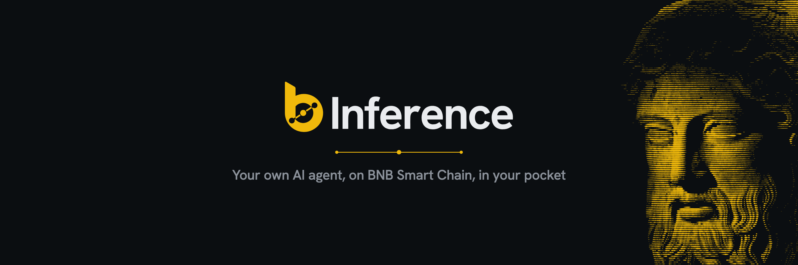
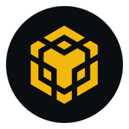
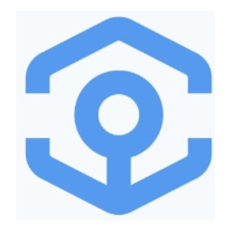
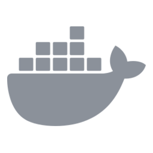

<p align="center">
  
</p>

<p align="center"><b>English</b> · <a href="README.zh.md">简体中文</a></p>

# bInference

bInference is an open-source AI agent for BNB Smart Chain. It researches, trades, earns and keeps your funds safe, running on your own machine and answering to you on Telegram.

**Your wallets, your rules, your tap.** The agent trades from wallets it creates, inside limits you set, and nothing leaves a wallet until you confirm it.

[Website](https://binference.io) · [X](https://x.com/getbinference)

> [!IMPORTANT]
> bInference is in development and not ready for real funds.

## What it does

### Trade every BSC launchpad &nbsp;&nbsp;&nbsp;

Launch your own token, catch new launches, trade the bonding curve and follow each token to its pool.

### Swap and automate &nbsp;&nbsp;

The best price across PancakeSwap, KyberSwap and OKX. Limit, take-profit, stop-loss, trailing stop, DCA and copy trading, run by code once you approve them.

### Earn and bridge &nbsp;&nbsp;&nbsp;&nbsp;&nbsp;&nbsp;

Lend on Venus, Lista and Aave, stake BNB, and bridge to other chains with Across, Relay and LI.FI.

### Research &nbsp;&nbsp;

Reads X, Binance Square and any web page to explain a token, a narrative or a wallet before you decide. Cards show when an idea came from what it read.

### Market intelligence &nbsp;&nbsp;&nbsp;&nbsp;

Prices, charts, liquidity, holders, new launches and smart-money wallets from GMGN, DEX Screener, GeckoTerminal, Birdeye and OKX.

### Full chain access &nbsp;&nbsp;&nbsp;&nbsp;&nbsp;

Reads any contract, wallet or transaction on BSC through public BNB Chain RPCs, or your own Alchemy, QuickNode, NodeReal, Ankr or Chainstack key, with automatic failover.

### Private execution &nbsp;&nbsp;&nbsp;

Every transaction is simulated first, then sent privately through 48 Club, BlockRazor, bloXroute or PancakeSwap MEV Guard, out of reach of front-running bots.

### Token safety &nbsp;

Before any buy of an unknown token, GoPlus, honeypot.is and its own buy-and-sell simulation catch honeypots, hidden taxes and owner tricks.

### Alerts and automation 

Price and wallet alerts, scheduled check-ins ("review my portfolio every morning"), and TradingView alerts that fire your pre-approved orders.

### Portfolio

Positions, profit and loss at average cost, a daily summary, and a CSV of every fill.

### Names and identity 

Send to `.bnb` names, and register each agent on chain with ERC-8004.

### Learns how you trade

Remembers your strategy and notes, and adds skills from Binance Skills Hub, BNB Chain, PancakeSwap and Flap.

## Binance Agents 

Connect the agents you run on Binance Agent OS and manage them from one place:

- **See** every trade they make, with its price and result.
- **Limit** what each agent may spend and trade.
- **Pause or stop** any agent with one tap.
- **Prove** results with a verified track record.
- **Trade** your Binance sub-account, with Binance holding the credentials.

## Your machine, your control &nbsp;&nbsp;&nbsp;

bInference runs on your own computer or server. Its keys stay there, encrypted, in a separate process the AI cannot reach. You talk to it on Telegram, in the web console (also inside Telegram as a Mini App), in the terminal, or from Claude Code, Codex and any MCP client.

Run one agent or several, each with its own wallets and limits, in English or Chinese. The bInference Router runs the AI by default; any compatible model provider works, local models included.

## Safe by design 

- Every transaction arrives as a card with exact amounts, fees and a simulated result. One tap sends it; no answer means no.
- Limits hold even after a tap: per-trade and 24-hour caps, slippage and tax limits, and send levels that decide where funds may go.
- Every new agent starts in paper mode, with virtual money and real quotes.
- `/freeze` stops everything. `/rescue` moves all funds to your own wallet.

## Install &nbsp;&nbsp;&nbsp;

macOS and Linux:

```bash
curl -fsSL https://binference.io/install.sh | sh
binference init
```

On Windows, in PowerShell:

```powershell
irm https://binference.io/install.ps1 | iex
```

Runs on macOS, Windows and Linux, on your computer, a server or Docker. The open-source agent charges no fees.

## Contributing

Read [AGENTS.md](AGENTS.md): every change, by a person or a coding agent, follows it.

## Security

Report security problems privately through [GitHub security advisories](../../security/advisories/new), never in a public issue.

## License

MIT
